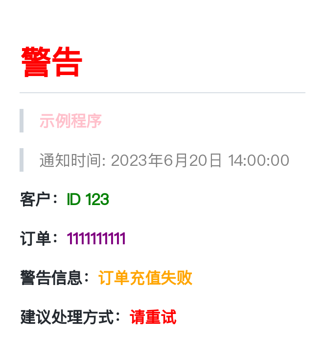

<!--
 * @Author: Abel
 * @Date: 2023-06-20 14:43:34
 * @LastEditTime: 2023-06-20 16:01:09
-->
## ``Markdown`` ``HTML`` 转png图片

### 用法

首先运行服务

```shell
docker compose up -d
```

#### ``Markdown``转图片

```python
import requests

data = {
    'type': 'markdown',
    'content': (
        f'# <font color=Red>警告</font>\n'
        f'> **<font color=Pink>示例程序</font>**\n'
        f'><font color=Gray>'
        f'通知时间: 2023年6月20日 14:00:00\n'
        f'</font>\n\n'
        f'**客户：<font color=Green>ID 123</font>**\n\n'
        f'**订单：<font color=Purple>1111111111</font>**\n\n'
        f'**警告信息：<font color=Orange>订单充值失败</font>**\n\n'
        f'**建议处理方式：<font color=Red>请重试</font>**\n\n'
    ),
}

resp = requests.post('http://{server_host}:9527/api/to_png', json=data)

with open('result.png', 'wb') as f:
    f.write(resp.content)
```

然后你会得到一张png图片



#### ``HTML``转图片

```python
import requests

data = {
    'type': 'markdown',
    'content': '''{your_html_str}''',
    'selector': '//body'
}

resp = requests.post('http://{server_host}:9527/api/to_png', json=data)

with open('result.png', 'wb') as f:
    f.write(resp.content)
```

不同的是多了``selector``参数，不传则默认为//body

## 写在最后

该项目只是因为本人在向微信群发送通知时，受消息格式的限制而搭建的小服务，代码非常简陋，还请各位大拿勿怪
